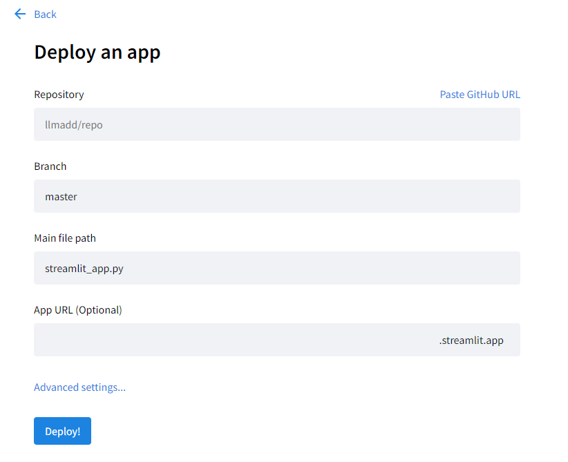
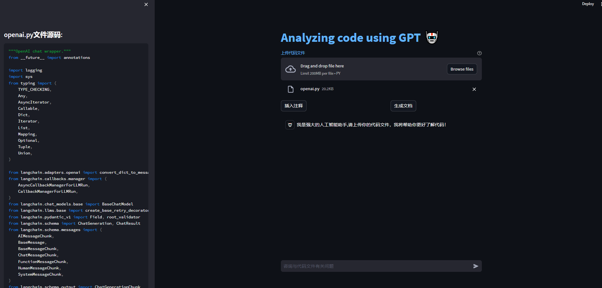
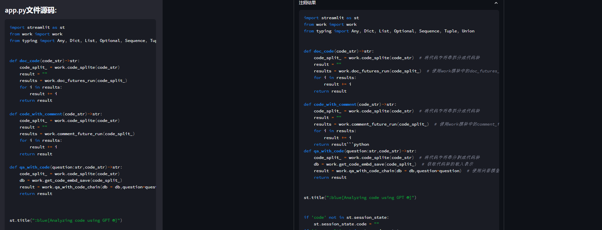
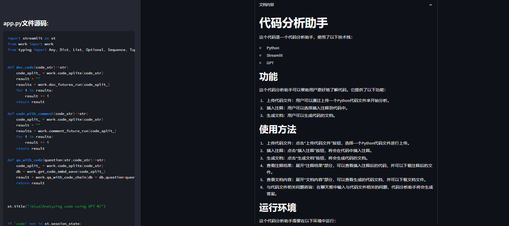
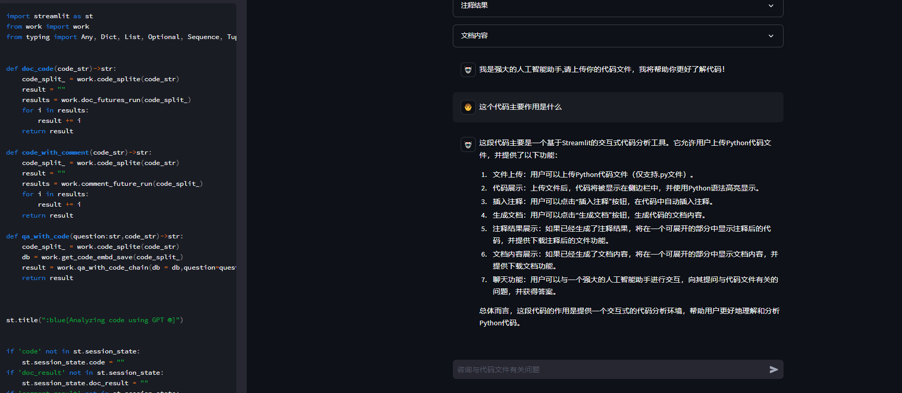

# 项目概述

## code_using_GPT

### 1. 项目简介

本项目主要通过使用ChatGPT,来为代码生成注释、生成README.md文档、以及根据代码文件与大模型进行问答，以便于更好的了解代码！

### Streamlit 一键部署


* fork本仓库后点击 `Streamlit 部署` 选择NEW APP

<p>
<a href="https://share.streamlit.io/">
<button style="background-color: #007bff; color: white; padding: 10px 20px; border: none; border-radius: 5px;">Streamlit 部署</button>
</a>
</p>



* Repository 选择fork的仓库
* Branch 一般默认为main
* Main file path为app.py
* App URL (Optional) 自定义域名
* 点击Deploy!即可

### 本地安装说明
1. 安装Git：

    如果您尚未安装Git，请首先安装它。您可以从Git官网下载适合您操作系统的版本：https://git-scm.com/downloads

2. 克隆GitHub存储库：

    打开命令行终端，并导航到您希望将项目克隆到的目录。然后运行以下命令，将GitHub存储库克隆到您的本地计算机：
```bash
git clone https://github.com/llmadd/code_using_GPT.git
```
 请将上述URL替换为您要克隆的GitHub存储库的实际URL。

3. 进入项目目录：

    使用cd命令进入克隆的存储库目录：
```bash
cd code_using_GPT
```

4. 创建虚拟环境（可选但建议）：

    为了隔离项目的依赖关系，您可以创建一个虚拟环境。运行以下命令创建并激活虚拟环境：

```bash
python -m venv venv
source venv/bin/activate   # 在Windows上使用 venv\Scripts\activate
```

5. 安装项目依赖项：

    使用pip安装requirements.txt文件中列出的所有依赖项：

```bash
pip install -r requirements.txt
```

这将安装项目所需的所有Python包。

6. 运行Streamlit应用程序：
    在命令行中运行以下命令来启动Streamlit应用程序：

```bash
streamlit run app.py
```

这将启动Streamlit应用程序，并在您的默认浏览器中打开应用程序界面。

### 3. 使用说明
上传文档后，界面如下：


* 可以点击注释代码按钮，为当前文件生成注释并下载


* 点击生成文档按钮，可以为代码生成解释文档并下载

* 可以与大模型交流，提出问题，大模型会根据问题相关代码回答


### 4. 项目使用技术栈

#### langchain+Streamlit+Openai+Chroma

* 使用langchain构建各流程chain

* 使用streamlit构建前端界面

* 使用openai，gpt3.5模型

* 使用chromadb为向量数据库

### 5. 待完善功能
- [x] 多语言支持(C、JAVA等)

- [x] 用户一键部署，更方便的openaikey修改

- [x] 用户可自主选择模型

- [ ] 一键格式化代码

- [ ] 更多需求可以联系我...

### 6. 联系我


